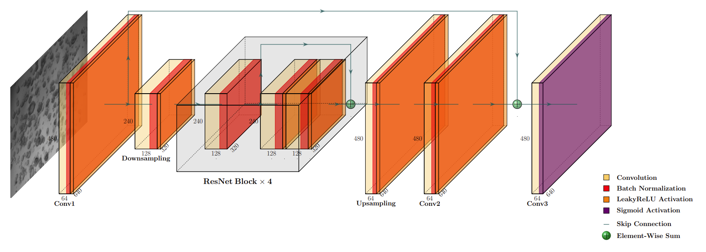
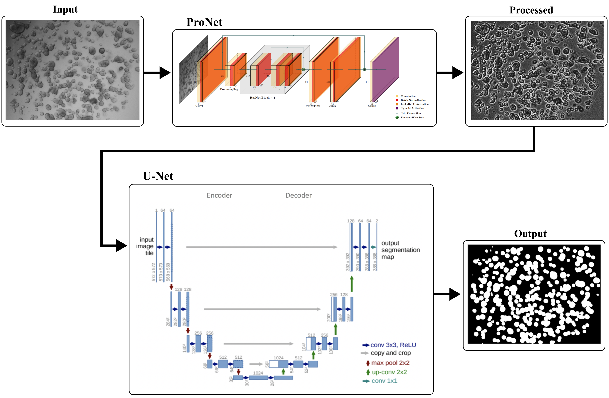

# ENNOS: Enhanced Neural Network For Organoid Segmentation
---
### A deep learning framework that combines a convolutional preprocessing module (ProNet) with a U-Net–based segmentation network. ProNet employs a novel multi- component loss function that integrates pixel-wise (MAE), structural (SSIM), and frequency-domain (Fourier) objectives to standardize image quality and enhance structural detail across diverse imaging conditions. Extensive validation on two independent datasets demonstrates that ENNOS outperforms existing methods in terms of accuracy (mAP 98.46%, mIoU 88.57%, mDICE 93.90%) and computational efficiency, while maintaining strong generalizability across different acquisition platforms. 
---

### Processing
The processing pipeline applied to every single image is the following:
- __Contrastive Limited Adaptive Histogram Equalization (CLAHE)__: Enhance local contrast while preserving noise over-amplification.
- __Illumination Correction__: Gaussian blur is used to generate a low-frequency background estimate suddenly subtracted from the original enhanced image pixel by pixel.
- __Equalization__: Global histogram equalization further redistributed pixel intensities to improve global contrast.
- __Smoothing__: Bilateral filtering suppressed noise while preserving edges, enhancing structural visibility for segmentation.

### ProNet: a CNN-based image processing architecture


## ENNOS Architecture
The proposed model is a dual-component neural architecture that integrates a
- __Processing Network (ProNet)__: CNN that applies image enhancement operations to the input, producing a refined version optimised for downstream analysis.
- __Segmentation Network__: U-Net architecture that receives the preprocessed image from the processing network and generates the corresponding segmentation mask.





## Dataset
The used dataset of segmented organoid from microscopy is available upon request to the authors. 

Make sure to organize your dataset as follows:
```
└── datasetName
    ├── TRAIN
    │   ├── IMG_001.*
    │   ├── MASK_001.*
    │   ├── IMG_002.*
    │   ├── MASK_002.*
    │   ├── IMG_003.*
    │   ├── MASK_003.*
    |   └── etc...
    ├── VAL
    │   ├── IMG_101.*
    │   ├── MASK_101.*
    │   ├── IMG_102.*
    │   ├── MASK_102.*
    |   └── etc...
    └── TEST
        ├── IMG_201.*
        ├── MASK_201.*
        └── etc...
---
```

# Getting Started

ENNOS has been implemented and tested with Python 3.12.11 and PyTorch 2.6.0

First clone the repo:
```
git clone https://github.com/DumitruScutelnic/ENNOS.git
```
Then install the environment and dependencies with:
```
conda env create -f ENNOS/conf/environment.yml
```

# Test

Write the following instructions using the command line:
```
conda activate ENNOS_Organoid
python -m ENNOS.test
```

## Citation

```bibtex
@inproceedings{ennos2025,
  title={ENNOS: Enhanced Neural Network For Organoid Segmentation},
  author={},
  booktitle = {},
  month = {},
  year = {2025}
}
```